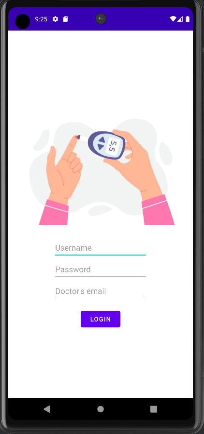
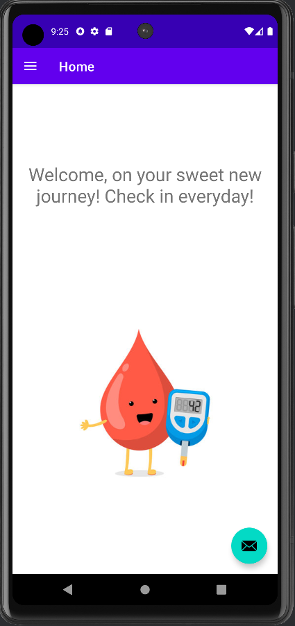
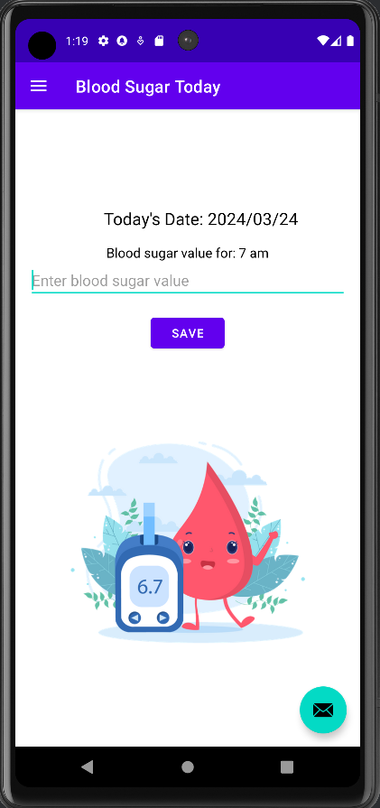
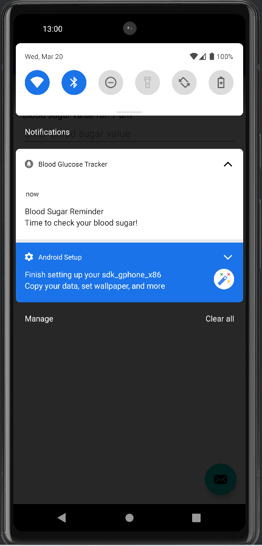
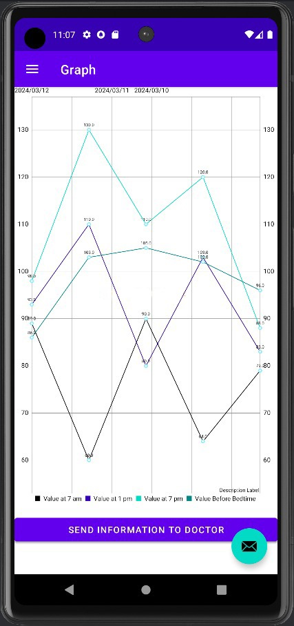
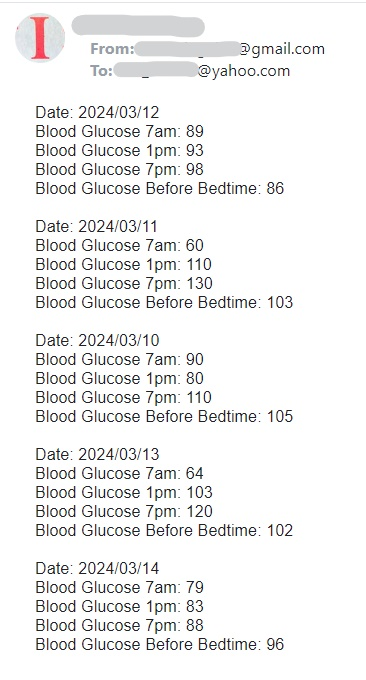

<h3 align="center">Blood Glucose Tracker app</h3>

This app was a project for the Android course. The app is meant to help diabetics to keep track of their glucose values.
The application is developed in Java, the server is implemented in C#, and phpMyAdmin is used for administrating the MySQL database.

<!-- TABLE OF CONTENTS -->

  
Contents

  <ol>
    <li>Blood Glucose App
      <ol>
        <li><a href="#Description">Description</a></li>
        <li><a href="#MainActivity">MainActivity</a></li>
        <li><a href="#LoginActivity">LoginActivity</a></li>
        <li><a href="#HomeFragment">HomeFragment</a></li>
        <li><a href="#BloodSugarToday">BloodSugarToday</a></li>
        <li><a href="#NotificationForegroundService">NotificationForegroundService</a></li>
        <li><a href="#GraphFragment">GraphFragment</a></li>
        <li><a href="#Constants">Constants</a></li>
      </ol>
    </li>
    <li>Server and Database 
      <ol>
        <li><a href="#Server">Server</a></li>
        <li><a href="#Database">Database</a></li>
      </ol>
    </li>
  </ol>

### Description

The Blood Glucose Tracker is an app, where the user can enter its daily blood glucose values, see the values in a graph, send the values to a doctor. 

(<a href="#readme-top">Back to Top</a>)

### MainActivity

The MainActivity is responsible for managing the app's navigation, handling the display of the fragments.

(<a href="#readme-top">Back to Top</a>)

### LoginActivity

This class is responsible for the login functionality of the app. The user needs to input a username, password and doctors email. After the login, the notification foreground service starts.

(<a href="#readme-top">Back to Top</a>)

### HomeFragment
This class is responsible for displaying a short welcome message to the home screen.

(<a href="#readme-top">Back to Top</a>)

### BloodSugarToday

This class is a fragment, where the user can write their blood sugar values ar different times in the day. At the end of the day, the information gets sent to the server, which sends it to the database. 

(<a href="#readme-top">Back to Top</a>)

### NotificationForegroundService

This class manages the foreground service for displaying notifications at specific times in the app. The notification times are set in the BloodSugarToday. 

(<a href="#readme-top">Back to Top</a>)

### GraphFragment

This class is responsible for displaying a graph of the users blood glucose values over time. It also contains a button to send this values to a doctor, whose email was noted in login info.

   

(<a href="#readme-top">Back to Top</a>)

### Constants
This class contains the static variables used in the app.

(<a href="#readme-top">Back to Top</a>)

### Server

Server application written in C#. It listens for incoming TCP connections, processes client requests, and interacts with a MySQL database. The Blood Glucose Tracker app sends the data with the first word as its action: retrieve or insert, then based on the action word the specific method is called.

(<a href="#readme-top">Back to Top</a>)

### Database

The Database is managed through phpMyAdmin. It contains the following columns: Username, Password, Email, Date, b7am (blood glucose levels measured at 7 am),b1pm (blood glucose levels measured at 1 pm), b7pm (blood glucose levels measured at 7 pm), bs (blood glucose levels measured before sleep.

(<a href="#readme-top">Back to Top</a>)

